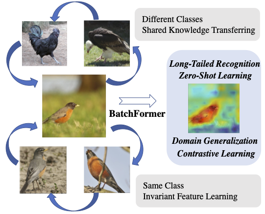
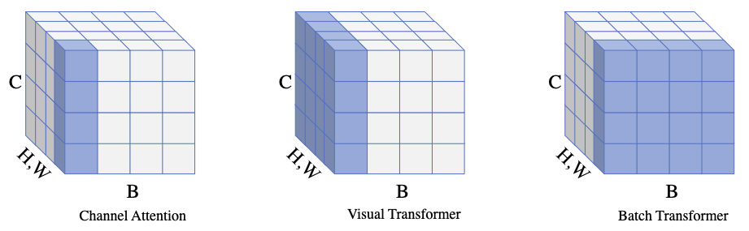

# BatchFormer: Learning to Explore Sample Relationships for Robust Representation Learning

## Introduction

This is the official PyTorch implementation of [BatchFormer](https://arxiv.org/abs/2203.01522) for Long-Tailed Recognition, Domain Generalization, Compositional Zero-Shot Learning, Contrastive Learning.

  

Sample Relationship Exploration for Robust Representation Learning
  

**Please also refer to [BatchFormerV2](https://arxiv.org/abs/2204.01254), in which we introduce a BatchFormerV2 module for vision Transformers.**

  

## Main Results

### Long-Tailed Recognition

##### ImageNet-LT
<table><tbody>
<!-- START TABLE -->
<!-- TABLE HEADER -->
<th valign="bottom"></th>
<th valign="bottom">All(R10)</th>
<th valign="bottom">Many(R10)</th>
<th valign="bottom">Med(R10)</th>
<th valign="bottom">Few(R10)</th>
<th valign="bottom">All(R50)</th>
<th valign="bottom">Many(R50)</th>
<th valign="bottom">Med(R50)</th>
<th valign="bottom">Few(R50)</th>
<!-- TABLE BODY -->
<tr><td align="left">RIDE(3 experts)[1]</td>
<td align="center">44.7</td>
<td align="center">57.0</td>
<td align="center">40.3</td>
<td align="center">25.5</td>
<td align="center">53.6</td>
<td align="center">64.9</td>
<td align="center">50.4</td>
<td align="center">33.2</td>
</tr>

<tr><td align="left">+BatchFormer</td>
<td align="center"><b>45.7</b></td>
<td align="center">56.3</td>
<td align="center"><b>42.1</b></td>
<td align="center"><b>28.3</b></td>
<td align="center"><b>54.1</b></td>
<td align="center">64.3</td>
<td align="center"><b>51.4</b></td>
<td align="center"><b>35.1</b></td>

<tr><td align="left">PaCo[2]</td>
<td align="center">-</td>
<td align="center">-</td>
<td align="center">-</td>
<td align="center">-</td>
<td align="center">57.0</td>
<td align="center">64.8</td>
<td align="center">55.9</td>
<td align="center">39.1</td>
</tr>

<tr><td align="left">+BatchFormer</td>
<td align="center">-</td>
<td align="center">-</td>
<td align="center">-</td>
<td align="center">-</td>
<td align="center"><b>57.4</b></td>
<td align="center">62.7</td>
<td align="center"><b>56.7</b></td>
<td align="center"><b>42.1</b></td>
</tbody></table>

Here, we demonstrate the result on one-stage RIDE (ResNext-50)
<table><tbody>
<!-- START TABLE -->
<!-- TABLE HEADER -->
<th valign="bottom"></th>
<th valign="bottom">All</th>
<th valign="bottom">Many</th>
<th valign="bottom">Medium</th>
<th valign="bottom">Few</th>

<!-- TABLE BODY -->
<tr><td align="left">RIDE(3 experts)*</td>
<td align="center">55.9</td>
<td align="center">67.3</td>
<td align="center">52.8</td>
<td align="center">34.6</td>
</tr>
    <tr><td align="left">+BatchFormer</td>
<td align="center"><b>56.5</b></td>
<td align="center">66.6</td>
<td align="center"><b>54.2</b></td>
<td align="center"><b>36.0</b></td>
</tbody></table>

##### iNaturalist 2018
<table><tbody>
<!-- START TABLE -->
<!-- TABLE HEADER -->
<th valign="bottom"></th>
<th valign="bottom">All</th>
<th valign="bottom">Many</th>
<th valign="bottom">Medium</th>
<th valign="bottom">Few</th>

<!-- TABLE BODY -->
<tr><td align="left">RIDE(3 experts)</td>
<td align="center">72.5</td>
<td align="center">68.1</td>
<td align="center">72.7</td>
<td align="center">73.2</td>
</tr>
    <tr><td align="left">+BatchFormer</td>
<td align="center"><b>74.1</b></td>
<td align="center">65.5</td>
<td align="center"><b>74.5</b></td>
<td align="center"><b>75.8</b></td>
</tbody></table>

#### Object Detection (V2)

<table><tbody>
<!-- START TABLE -->
<!-- TABLE HEADER -->
<th valign="bottom"></th>
<th valign="bottom">AP</th>
<th valign="bottom">AP50</th>
<th valign="bottom">AP75</th>
<th valign="bottom">APS</th>
<th valign="bottom">APM</th>
<th valign="bottom">APL</th>
<th valign="bottom">Model</th>

<!-- TABLE BODY -->
<tr><td align="left">DETR</td>
<td align="center">34.8</td>
<td align="center">55.6</td>
<td align="center">35.8</td>
<td align="center">14.0</td>
<td align="center">37.2</td>
<td align="center">54.6</td>
</tr>
    <tr><td align="left">+BatchFormerV2</td>
<td align="center"><b>36.9</b></td>
<td align="center"><b>57.9</b></td>
<td align="center"><b>38.5</b></td>
<td align="center"><b>15.6</b></td>
<td align="center"><b>40.0</b></td>
<td align="center"><b>55.9</b></td>
<td align="center"><a href="https://unisydneyedu-my.sharepoint.com/:u:/g/personal/zhou9878_uni_sydney_edu_au/EUn-InXA-ClMpGaN2emuwpgBarc-_B-IYlYuKs6dvwVn8g?e=dzmX8l">download</a></td>

<tr><td align="left">Conditional DETR</td>
<td align="center">40.9</td>
<td align="center">61.8</td>
<td align="center">43.3</td>
<td align="center">20.8</td>
<td align="center">44.6</td>
<td align="center">59.2</td>
</tr>
    <tr><td align="left">+BatchFormerV2</td>
<td align="center"><b>42.3</b></td>
<td align="center"><b>63.2</b></td>
<td align="center"><b>45.1</b></td>
<td align="center"><b>21.9</b></td>
<td align="center"><b>46.0</b></td>
<td align="center"><b>60.7</b></td>
<td align="center"><a href="https://unisydneyedu-my.sharepoint.com/:u:/g/personal/zhou9878_uni_sydney_edu_au/EX2ulrdzhQBFhOr9mYyLCq0BFONL8IV4QFltr1Sn5RJCcQ?e=cXR2DL">download</a></td>

<tr><td align="left">Deformable DETR</td>
<td align="center">43.8</td>
<td align="center">62.6</td>
<td align="center">47.7</td>
<td align="center">26.4</td>
<td align="center">47.1</td>
<td align="center">58.0</td>
</tr>
    <tr><td align="left">+BatchFormerV2</td>
<td align="center"><b>45.5</b></td>
<td align="center"><b>64.3</b></td>
<td align="center"><b>49.8</b></td>
<td align="center"><b>28.3</b></td>
<td align="center"><b>48.6</b></td>
<td align="center"><b>59.4</b></td>
<td align="center"><a href="https://unisydneyedu-my.sharepoint.com/:f:/g/personal/zhou9878_uni_sydney_edu_au/Em284ufvPkBHi5Eh_vbM4_ABP3c4eXPg_RANRfos2VmO8Q?e=2PhkUs">download</a></td>

</tbody></table>

The backbone is ResNet-50. The training epoch is 50.

#### Panoptic segmentation (V2)

<table><tbody>
<!-- START TABLE -->
<!-- TABLE HEADER -->
<th valign="bottom"></th>
<th valign="bottom">PQ</th>
<th valign="bottom">SQ</th>
<th valign="bottom">RQ</th>
<th valign="bottom">PQ(th)</th>
<th valign="bottom">SQ(th)</th>
<th valign="bottom">RQ(th)</th>
<th valign="bottom">PQ(st)</th>
<th valign="bottom">SQ(st)</th>
<th valign="bottom">RQ(st)</th>
<th valign="bottom">AP</th>
<!-- TABLE BODY -->
<tr><td align="left">DETR</td>
<td align="center">43.4</td>
<td align="center">79.3</td>
<td align="center">53.8</td>
<td align="center">48.2</td>
<td align="center">79.8</td>
<td align="center">59.5</td>
<td align="center">36.3</td>
<td align="center">78.5</td>
<td align="center">45.3</td>
<td align="center">31.1</td>

</tr>
    <tr><td align="left">+BatchFormerV2</td>
<td align="center"><b>45.1</b></td>
<td align="center"><b>80.3</b></td>
<td align="center"><b>55.3</b></td>
<td align="center"><b>50.5</b></td>
<td align="center"><b>81.1</b></td>
<td align="center"><b>61.5</b></td>

<td align="center"><b>37.1</b></td>
<td align="center"><b>79.1</b></td>
<td align="center"><b>46.0</b></td>
<td align="center"><b>33.4</b></td>
</tbody></table>

#### Contrastive Learning
<table><tbody>
<!-- START TABLE -->
<!-- TABLE HEADER -->
<th valign="bottom"></th>
<th valign="bottom">Epochs</th>
<th valign="bottom">Top-1</th>
<th valign="bottom">Pretrained</th>
<!-- TABLE BODY -->
<tr><td align="left">MoCo-v2[3]</td>
<td align="center">200</td>
<td align="center">67.5</td>
<td align="center"></td>
</tr>
<tr><td align="left">+BatchFormer</td>
<td align="center">200</td>
<td align="center"><b>68.4</b></td>
  <td align="center"><a href="https://cloudstor.aarnet.edu.au/plus/s/nnepE6cPmEPMOkv">download</a></td>

<tr><td align="left">MoCo-v3[4]</td>
<td align="center">100</td>
<td align="center">68.9</td>
</tr>
<tr><td align="left">+BatchFormer</td>
<td align="center">100</td>
<td align="center"><b>69.6</b></td>
    <td align="center"><a href="https://cloudstor.aarnet.edu.au/plus/s/IHxiZW3I8iiDS5u">download</a></td>
</tbody></table>

Here, we provide the pretrained MoCo-V3 model corresponding to [this strategy](https://github.com/zhihou7/BatchFormer/blob/cc7a060c6395cb1dc8a7c577df77f52a44deaf9d/moco-v3/moco/builder.py#L139).

#### Domain Generalization

##### ResNet-18

<table><tbody>
<!-- START TABLE -->
<!-- TABLE HEADER -->
<th valign="bottom"></th>
<th valign="bottom">PACS</th>
<th valign="bottom">VLCS</th>
<th valign="bottom">OfficeHome</th>
<th valign="bottom">Terra</th>

<!-- TABLE BODY -->
<tr><td align="left">SWAD[5]</td>
<td align="center">82.9</td>
<td align="center">76.3</td>
<td align="center">62.1</td>
<td align="center">42.1</td>
</tr>
    <tr><td align="left">+BatchFormer</td>
<td align="center"><b>83.7</b></td>
<td align="center"><b>76.9</b></td>
<td align="center"><b>64.3</b></td>
<td align="center"><b>44.8</b></td>
</tbody></table>

#### Compositional Zero-Shot Learning
<table><tbody>
<!-- START TABLE -->
<!-- TABLE HEADER -->
<th valign="bottom"></th>
<th valign="bottom">MIT-States(AUC)</th>
<th valign="bottom">MIT-States(HM)</th>
<th valign="bottom">UT-Zap50K(AUC)</th>
<th valign="bottom">UT-Zap50K(HM)</th>
<th valign="bottom">C-GQA(AUC)</th>
<th valign="bottom">C-GQA(HM)</th>
<!-- TABLE BODY -->
<tr><td align="left">CGE*[6]</td>
<td align="center">6.3</td>
<td align="center">20.0</td>
<td align="center">31.5</td>
<td align="center">46.5</td>
<td align="center">3.7</td>
<td align="center">14.9</td>
</tr>
    <tr><td align="left">+BatchFormer</td>
<td align="center"><b>6.7</b></td>
<td align="center"><b>20.6</b></td>
<td align="center"><b>34.6</b></td>
<td align="center"><b>49.0</b></td>
<td align="center"><b>3.8</b></td>
<td align="center"><b>15.5</b></td>
</tbody></table>

#### Few-Shot Learning
Experiments on CUB.

<table><tbody>
<!-- START TABLE -->
<!-- TABLE HEADER -->
<th valign="bottom"></th>
<th valign="bottom">Unseen</th>
<th valign="bottom">Seen</th>
<th valign="bottom">Harmonic mean</th>

<!-- TABLE BODY -->
<tr><td align="left">CUB[7]*</td>
<td align="center">67.5</td>
<td align="center">65.1</td>
<td align="center">66.3</td>
</tr>
    <tr><td align="left">+BatchFormer</td>
<td align="center"><b>68.2</b></td>
<td align="center"><b>65.8</b></td>
<td align="center"><b>67.0</b></td>
</tbody></table>

#### Image Classification (V2)

<table><tbody>
<!-- START TABLE -->
<!-- TABLE HEADER -->
<th valign="bottom"></th>
<th valign="bottom">Top-1</th>
<th valign="bottom">Top-5</th>
<!-- TABLE BODY -->
<tr><td align="left">DeiT-T</td>
<td align="center">72.2</td>
<td align="center">91.1</td>
</tr>
    <tr><td align="left">+BatchFormerV2</td>
<td align="center"><b>72.7</b></td>
<td align="center"><b>91.5</b></td>

<tr><td align="left">DeiT-S</td>
<td align="center">79.8</td>
<td align="center">95.0</td>
</tr>
    <tr><td align="left">+BatchFormerV2</td>
<td align="center"><b>80.4</b></td>
<td align="center"><b>95.2</b></td>

<tr><td align="left">DeiT-B</td>
<td align="center">81.7</td>
<td align="center">95.5</td>
</tr>
    <tr><td align="left">+BatchFormerV2</td>
<td align="center"><b>82.2</b></td>
<td align="center"><b>95.8</b></td>
</tbody></table>

#### Reference

1. Long-tailed recognition by routing diverse distribution-aware experts. In ICLR, 2021
2. Parametric contrastive learning. In ICCV, 2021
3. Improved baselines with momentum contrastive learning.
4. An empirical study of training self-supervised vision transformers. In CVPR, 2021
5. Domain generalization by seeking flat minima. In NeurIPS, 2021.
6. Learning graph embeddings for compositional zero-shot learning. In CVPR, 2021
7. Contrastive learning based hybrid networks for long- tailed image classification. In CVPR, 2021

## PyTorch Code

The proposed BatchFormer can be implemented with a few lines as follows,

    def BatchFormer(x, y, encoder, is_training):
        # x: input features with the shape [N, C]
        # encoder: TransformerEncoderLayer(C,4,C,0.5)
        if not is_training:
            return x, y
        pre_x = x
        x = encoder(x.unsqueeze(1)).squeeze(1)
        x = torch.cat([pre_x, x], dim=0)
        y = torch.cat([y, y], dim=0)
        return x, y

## Citation
If you find this repository helpful, please consider cite:

    @inproceedings{hou2022batch,
        title={BatchFormer: Learning to Explore Sample Relationships for Robust Representation Learning},
        author={Hou, Zhi and Yu, Baosheng and Tao, Dacheng},
        booktitle={CVPR},
        year={2022}
    }
    @article{hou2022batchformerv2,
       title={BatchFormerV2: Exploring Sample Relationships for Dense Representation Learning},
       author={Hou, Zhi and Yu, Baosheng and Wang, Chaoyue and Zhan, Yibing and Tao, Dacheng},
       journal={arXiv preprint arXiv:2204.01254},
       year={2022}
    }

Feel free to contact "zhou9878 at uni dot sydney dot edu dot au" if you have any questions.
